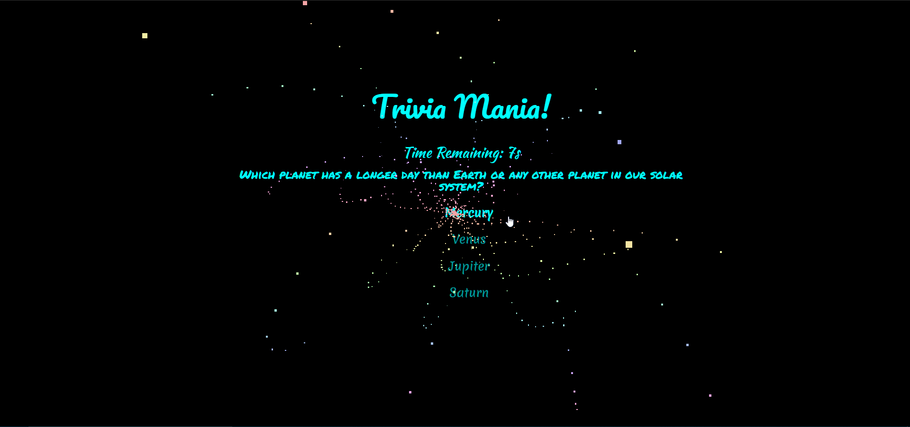

# Galactic Trivia Mania!

Welcome to Galactic Trivia Mania! There are 10 questions in total based on our universe and space history!

To try out the game, you play play a [deployment](https://esarnb.github.io/TriviaGame/)

## Getting Started

To play this on your local machine, you may download all folders and the index.html. Open the index.html with your preferred browser to start playing the game.

### Installing

To deploy on a live system, such as your website, you will need a web server [like Apache2 for Ubuntu 16.04](https://www.digitalocean.com/community/tutorials/how-to-install-the-apache-web-server-on-ubuntu-16-04).

Then place the folders and files in the subfolder of your choice within the html root directory.

That's it!

## Built With

* HTML 
* CSS
* JQuery

## Authors

* **Esar Behlum** 

